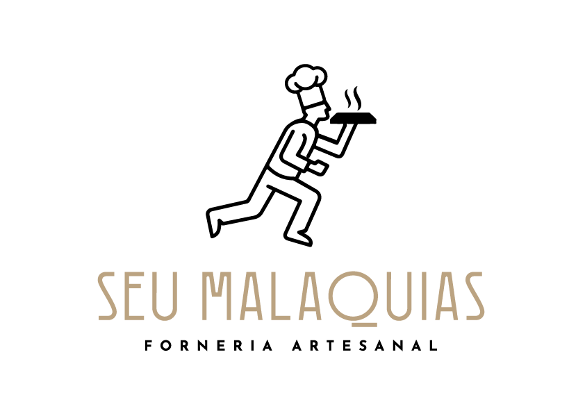

<p align="center">
  
</p>

<h1 align="center">Seu Malaquias — Forneria Artesanal</h1>

<p align="center">
  <em>Dark kitchen de pizzas artesanais com massa de fermentação natural · Boa Viagem, Recife — PE</em>
</p>

---

## O Projeto

**Seu Malaquias** é uma dark kitchen especializada em pizzas artesanais de alto padrão, localizada no bairro de **Boa Viagem, Recife**. O negócio nasce para atender um público exigente que busca ingredientes selecionados, processo artesanal e sabores exclusivos — entregues com a agilidade e o afeto de quem foi criado para isso.

---

## A Marca

### Nome e Conceito

O nome vem do latim *Malachias* — que significa **mensageiro**. A partir desse significado, foi criado um personagem que traduz tudo o que a marca deseja entregar:

> *"Chegou Seu Malaquias. Sempre uma boa companhia."*

O Seu Malaquias é aquele que chega com a pizza perfeita, no tempo certo, com o calor de sempre. A marca se conecta às pessoas através de memórias afetivas — o diálogo à mesa, o cheiro da massa, a chegada esperada.

### Valores da Marca

- **Afeto** — cada pizza carrega cuidado e intenção
- **Alto padrão de qualidade** — ingredientes selecionados, processo controlado
- **Humanização** — uma marca com rosto, com história, com personalidade
- **Agilidade** — entrega rápida sem abrir mão do artesanal
- **Simpatia** — uma experiência que vai além da comida

### Produto

- Massa de **longa fermentação natural** (sourdough)
- **Molho de tomate da casa** — receita própria
- **Ingredientes selecionados** de procedência verificada
- **Sabores únicos e exclusivos** — sem paralelo nos cardápios convencionais

---

## Identidade Visual

A identidade visual foi desenvolvida pela [**Abacat.work**](https://abacat.work) em 2022.

### Mascote

O símbolo central da marca é um **chef em movimento** — correndo, com a bandeja fumegante erguida — sobreposto à letra **M**, inicial de Malaquias. A ilustração comunica ao mesmo tempo:

- *Agilidade* na entrega
- *Excelência* no preparo
- *Personalidade* humana e afetiva

### Paleta de Cores

| Nome | Referência | Aplicação |
|---|---|---|
| Dourado Malaquias | Pantone 23-5 U | Cor primária da marca — wordmark e detalhes |
| Preto | Pantone Black | Contornos do mascote, tipografia de apoio |

### Tipografia

**Josefin Sans** — fonte geométrica, elegante e de alta legibilidade, utilizada em peso variável. Disponível em versão regular e itálica.

- `fontes/JosefinSans-VariableFont_wght.ttf`
- `fontes/JosefinSans-Italic-VariableFont_wght.ttf`

---

## Logos Disponíveis

| Arquivo | Descrição | Uso recomendado |
|---|---|---|
| `logo-seu-malaquias-preto.png` | Logo completo — mascote + wordmark + "Forneria Artesanal" | Aplicações principais em fundo claro |
| `logo-seu-malaquias-branco.png` | Wordmark "SEU MALAQUIAS" em dourado | Versão reduzida para fundo claro |
| `logo-seu-malaquias-icone-preto.png` | Ícone — mascote + letra M (bicolor: preto + dourado) | Ícones, avatares, aplicações quadradas |
| `logo-seu-malaquias-icone-allblack.png` | Ícone monocromático preto | Aplicações monocromáticas |
| `logo-seu-malaquias-preto-branco.png` | Ícone silhueta em dourado | Versão minimalista / branding compacto |

---

## Estrutura do Repositório

```
seu-malaquias/
├── README.md
├── identidade-visual.pdf       # Documento completo de identidade visual
├── logo/
│   ├── logo-seu-malaquias-preto.png
│   ├── logo-seu-malaquias-branco.png
│   ├── logo-seu-malaquias-icone-preto.png
│   ├── logo-seu-malaquias-icone-allblack.png
│   └── logo-seu-malaquias-preto-branco.png
└── fontes/
    ├── JosefinSans-VariableFont_wght.ttf
    └── JosefinSans-Italic-VariableFont_wght.ttf
```

---

## Localização

**Boa Viagem · Recife · Pernambuco · Brasil**

Dark kitchen — pedidos via delivery.

---

## Design

Identidade visual criada por [**Abacat.work**](https://abacat.work)
